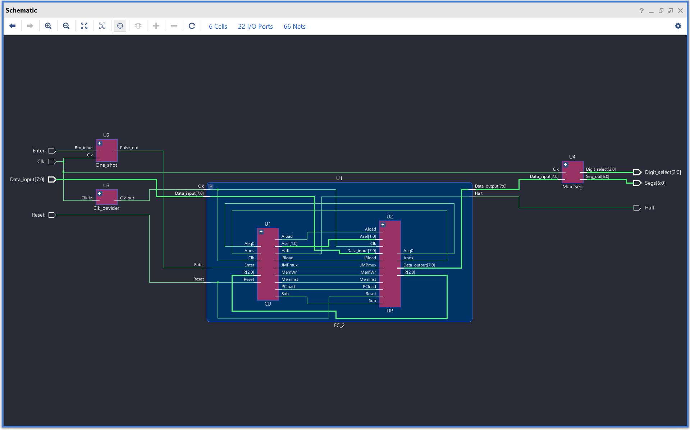

# 8-Bit SystemVerilog Microcontroller Project

This project implements an 8-bit microcontroller (uC) capable of executing assembly code directly from pre-loaded RAM. It is a new version written entirely in SystemVerilog, offering improved structure, readability, and synthesis compatibility. Below is the detailed description of the RAM content and the assembly programs implemented.

## RAM Configuration

- **DEPTH**: 32 (5-bit address space)
- **WIDTH**: 8 bits
- **ADDRESS_RADIX**: Binary
- **DATA_RADIX**: Binary

The RAM is pre-loaded with assembly instructions and data for various programs. The opcodes and their functionality are as follows:

### Opcodes
- `000`: `load A, mmmmm` - Load data from memory address `mmmmm` into Register A.
- `001`: `store A, mmmmm` - Store the value of Register A into memory address `mmmmm`.
- `010`: `add A, mmmmm` - Add the value at memory address `mmmmm` to Register A.
- `011`: `sub A, mmmmm` - Subtract the value at memory address `mmmmm` from Register A.
- `100`: `in A` - Input a value into Register A.
- `101`: `jz mmmmm` - Jump to address `mmmmm` if the result is zero (`is Equal to 0` bit is set).
- `110`: `jpos mmmmm` - Jump to address `mmmmm` if the result is positive (`is Positive` bit is set).
- `111`: `halt` - Stop execution.

## Components

This microcontroller is built using the following components:

1. **Arithmetic Logic Unit (ALU)**:
   - Performs addition and subtraction operations.
   - Outputs status flags: `is Positive` and `is Equal to 0`.

2. **Register A**:
   - An 8-bit general-purpose register for temporary data storage.

3. **RAM**:
   - A 32-location memory module, each location storing 8 bits of data.
   - Pre-loaded with assembly instructions and data.

4. **Program Counter (PC)**:
   - Tracks the current instruction address.
   - Automatically increments after each instruction fetch.

5. **Control Unit (CU)**:
   - Decodes instructions and manages the flow of data between components.

6. **Clock and Reset**:
   - Synchronizes operations and initializes the microcontroller.

7. **Input/Output Interface**:
   - Allows interaction with external devices for data input and output.



These components work together to execute assembly instructions stored in RAM.

## Programs in RAM

### 1. **Testing Program**
This program performs basic operations to test the microcontroller's functionality.

- **Instructions**:
  ```
  00000 : 10000000; -- input A
  00001 : 00111110; -- store A,11110
  00010 : 00011111; -- load A,11111
  00011 : 01011110; -- add A,11110
  00100 : 11111111; -- halt
  ```

### 2. **Sum N Down to 1**
This program calculates the sum of numbers from `N` down to `1`.

- **Instructions**:
  ```
  00000 : 00011101; -- load A,one
  00001 : 01111101; -- sub A,one
  00010 : 00111110; -- store A,sum
  00011 : 10000000; -- input A
  00100 : 00111111; -- store A,n
  00101 : 00011111; -- loop: load A,n
  00110 : 01011110; -- add A,sum
  00111 : 00111110; -- store A,sum
  01000 : 00011111; -- load A,n
  01001 : 01111101; -- sub A,one
  01010 : 00111111; -- store A,n
  01011 : 10101101; -- jz out
  01100 : 11000101; -- jp loop
  01101 : 00011110; -- out: load A,sum
  01110 : 11111111; -- halt
  ```

- **Memory Variables**:
  ```
  11101 : 00000001; -- one
  11110 : 00000000; -- sum
  11111 : 00000000; -- n
  ```

## How to Use

1. Pre-load the RAM with the desired program.
2. Compile the design in your FPGA tool (e.g., Vivado).
3. Simulate the program to verify its functionality.
4. Program the design onto an FPGA to test the microcontroller in hardware.

## Applications

This project demonstrates the design and implementation of a basic microcontroller capable of executing assembly code. It includes programs for testing, summing numbers, calculating GCD, and counting down, making it a versatile learning tool for microcontroller design.

## Future Enhancements

- Add support for more complex instructions (e.g., multiplication, division).
- Expand the RAM size for larger programs.
- Implement additional registers for more versatile data handling.
- Add support for interrupts and I/O operations.